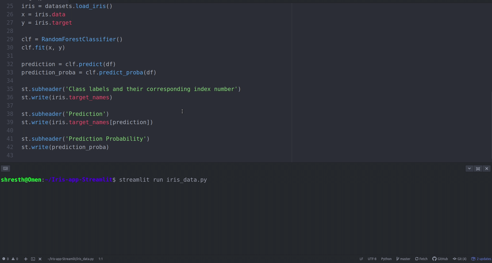

# Iris-app-Streamlit

### What does this app do:
* This app helps to determine the species of the Iris flower.

* You can toggle the features using the slider on the sidebar and the app dynamically loads and shows you the prediction.

* The model classifies into the three Iris species namely Setosa, Virginica and Versicolor.



## How to run the app?

### Clone the repository

You need to first clone this repository using the following command on your terminal
```bash
git clone https://github.com/shresth26/Iris-app-Streamlit.git
```

### Install the dependencies
##### Streamlit
```bash
pip install streamlit
```
##### scikit-learn
```bash
pip install -U scikit-learn
```

To run the app you can type the following
```bash
streamlit run iris_data.py
```

You can access the dataset from <a href = 'https://www.kaggle.com/uciml/iris'> here </a>
